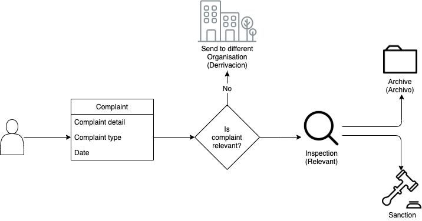
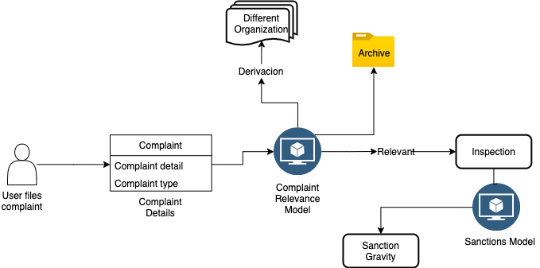
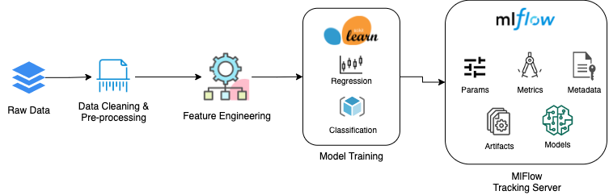

# Project Overview

# Introduction
SMA (The Superintendency of the Environment) is the environmental regulator of Chile. SMA receives environmental complaints from citizens and other organizations, and must determine if the complaint should get an inspection or not. If the inspection reveals any infractions of environmental regulations, a sanction procedure is initiated and can lead to a monetary fine. 

# Problem Statement

### SMA Complaint Process
The SMA Organization had a straight forward process for handling complaints filed by citizens. The problem with this system is the complaints are filed using a paper form, and SMA has to transcribe this information before entering it into their database systems. This transcription process can be very time consuming and is error prone since a transcriber could introduce human error. For this reason, SMA recently launched an online platform which allows citizens to submit complaints directly to the organization. This online platform also makes the complaints procedure accessible to more people in more remote locations, enabling SMA to get more reliable information to help them protect ecosystems and public health.

### The Problem
Since the introduction of the new online platform, the volume of incoming complaints has quadrupled, and hence carrying out inspections and sanctions for the complaints is getting increasingly difficult. This project aims to build a machine learning system that serves two main purposes:

1. It determines if the complaint is relevant or not to SMA, in which case an analyst can launch an inspection or redirect the complaint as required. Once an inspection is carried out, the complaint is either archived if there is not enough evidence to substantiate the complaint, otherwise, a sanction procedure is initiated.

2. It attempts to determine what the sanction of a complaint should be, based on historical complaints, inspections and sanctions.

# Solution Approach
This project proposes two solutions to solve the above problem:

1. A Random Forest classification model that classifies an incoming complaint into three separate targets: *Archivo I*, *Derivacion* or *Relevant*.

    a. Archivo I: The complaint is not relevant to SMA or other organizations
    b. Derivacion: The complaint is not relevant to SMA, but should be passed on to a different organization
    c. Relevant: The complaint is relevant to SMA and an inspection should be carried out

2. A classification model that classifies the sanction infraction level into *High* or *Low*.

# Solution Design
For this problem, we decided to split the models into two separate models, with each running independently of the other. The Relevance model classifies the complaints into three target values while the Sanction Gravity model predicts the gravity of complaints as either high or low.

Both models utilize a pipeline structure built in python on top of the [Scikit Learn](https://scikit-learn.org/stable/index.html) python library and the MLflow library which is used to track the experiments. The pipeline consists of three main steps:
- Data preparation    
- Feature Engineering, and     
- Running Experiments      
Running the model training script starts a new experiment, with all the details logged into the MLflow dashboard. 

### Data Exploration and Feature Engineering
An estimated 60% of the time in this project was spent on data exploration and feature engineering. A detailed explanation of the important features and the details of all the feature engineering steps can be found in the [Feature Engineering](set-up/feature-engineering) documentation page.

### Training The Models
The two models utilize Scikit Learn as a backend for model training. Scikit Learn provides a detailed API for building machine learning models which we utilized in this project. The model training step is wrapped in the [TrainModel](api-docs/train_model) class, providing a way to train one or multiple model algorithms with just one function call. The [TrainModel API](api-docs/train_model) documentation provides more details on using this class to train a model.

Once the models are trained, various metrics and parameters from the models are logged to MLflow in experiments. Each experiment tracks a particular run of the model training step, and the various metrics registered in this process can be compared across runs.

### Tracking Experiments in MLflow
The MLflow platform allows for easy experiment tracking across various training iterations. Various metrics, parameters and artifacts generated during the training process can be tracked in MLflow. These metrics include the model accuracy, F1-Score, confusion matrix, precision and recall scores. The model hyper-parameters and feature set are also tracked in MLflow along with the pickled model(s). We can then compare the various metrics collected across multiple runs to find the best performing model.

​
### Model Deployment and Making Inferences with Models
Once we have the models built, the models are then deployed into SMA's Azure instance. The Azure instance is an Ubuntu 18 virtual machine with various dependencies installed to support making predictions. These dependencies include Python, the MLFlow library and Scikit Learn. (See the [Project Setup](project-setup) page for more details on the project dependencies. The model predictions are set up to run every 24 hours via a crontab.

Once the model is deployed, predictions can be made by getting data from an ETL process and passing the data into the feature modelling pipeline (data preprocessing, transformations, feature extraction, training, etc). See [Deploying a Model] for more details about the deployment process.

# Challenges Faced

## 1. Limitations of the dataset

We faced a number of challenges when working with this dataset. We detail them here in the hope that this may be helpful in informing data collection and future modelling projects.

### 1.1 Class imbalance
The distribution of the classes we were trying to predict for the relevance model was heavily imbalanced. The `Archivo` class had far fewer data points than the `Derivacion` and `Relevant` classes. We used undersampling and oversampling in a attempt to solve this problem. See the [Relevance Model Report](relevance-model/relevance-model-report) for more details on the attempted solution(s).

### 1.2	Class imbalance depending on facility information
There was also a very large class imbalance between complaints which mention a facility and complaints which do not, but it is not clear if this truly is an integral feature of the data being collected or if it just happened to be the case in the dataset that has been collected until now.

### 1.3	A lot of complaints did not have an end type
The vast majority of complaints in our dataset had EndType `NaN`, meaning that we were left with relatively little data on which to train, validate and test our Relevance Model.

### 1.4	Small size of the dataset
The relatively small size of the dataset was particularly an issue because it meant that undersampling and oversampling data to even out the class distribution left us with little data on which to train, validate and test. A larger dataset could also open the door to more data-intensive algorithms such as Neural Networks.

### 1.5	Availability of geographical information
We received a lot of geographical data about the different districts of Chile towards the end of the project. We did some exploration and experimentation with these, and some of the features are used in our final models. However, as time was short in the last stages of the project, it is possible that this geographical data still contains some signal which we have not yet fully extracted. We would therefore encourge the SMA team to perform more feature engineering on the geographical features to see if there is any more valuable information to extract.

### 1.6	The nature of the Archivo I class
The Archivo I class is a catch-all class for any complaints which are discarded or ignored. There are many different reasons why complaints may end up in this class, making it difficult to find a pattern in that class.

### 1.7	The relationship between complaint details and sanctions is not granular
The individual complaint details are not related with the individual sanction infractions, making it difficult to understand exactly what fact leads to what sanction gravity.

### 1.8	Complaints may have received the wrong end type
For example, there were several complaints which were only inspected many years after the complaint date. By that point, the inspection is probably too late to reveal anything and the complaint ends up in Archivo II, even though there may have been a genuine cause for sanction at the time of the complaint.

## 2. Limitations with the deployment environment
Initially we planned to deploy the application as a Docker container, exposing an API through which predictions could be made by sending REST API calls. However, due to limitations with building the container and other issues we ran into (including having no internet access within the development platform), we decided to drop the Docker deployment step completely and deploy to SMA's Azure instance instead.

# Future Work
While the models work as expected and we have tried various iterations of feature engineering and selection, as well as various experiment runs, there is still room for improvement in the process, and changes to the modelling process that could improve performance. Below, we highlight some of the work that could be done to either improve the modelling process or the overall development pipeline.

## 1. The models should be re-trained at regular intervals
As new data becomes available, each model should be re-trained regularly to ensure that the best possible model is produced using the data at hand. In particular, if new features become available, it would be beneficial to try incorporating these features (and any transformations of these features) into the model, as this may help to improve performance. Additional data points (i.e. new complaints) could also help the model to find more signal. It will be particularly important to retrain the model on new data coming in through the online complaint form, as our model is trained mainly on data which predates this online system.

## 2. Automated GridSearch for hyperparameter tuning
Rather than needing to re-run hyperparameter tuning manually every time the model is re-trained, it is possible to set up automated hyperparameter tuning. This would ensure that the model is always optimized for the best performance.

## 3. Streamline Deployment Using Scalable Technology
Although the current deployment process works just fine, it can be tedious to debug and setup, and it doesn't quite scale too well. A future improvement will be to write scripts that can automate the deployment and auto scale the model prediction capabilities once the model is deployed. Technologies like Docker would make porting the model to new environments significantly easier (if this is ever required) and Kubernetes would make deploying the model at a larger scale better.
