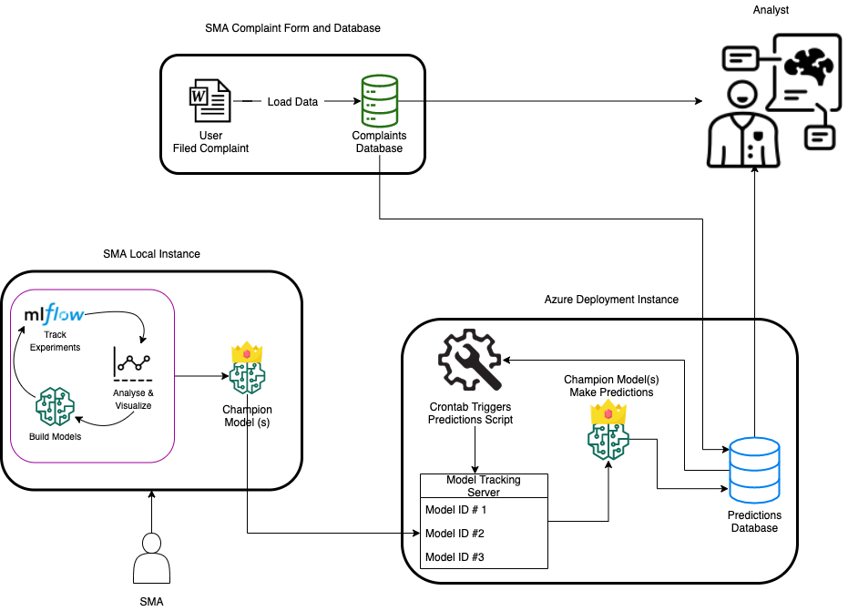

# Setting Up the Deployment Environment
This section will cover how to setup a deployment environment for the model
<hr>

# Introduction
This guide will walk through setting up a deployment environment for the models built in the training step. After the training is complete, the training script generates a pickled model which we can load into a production environment. 



# Getting Started
The deployment of this project happens in two phases:

1. The model is built locally, producing a pickled file
2. The output is moved to Microsoft Azure running a CRONTAB on a file every 24 hours that runs new predictions

# Set Up
### Installing Python and Dependencies
The deployment environment would need to have Python installed. See the [Getting Started](../getting-started) section for detailed instructions of how to install Python.

!!! note
    You should install the same Python version on the deployment environment as the one used during the model training. This will ensure consistency and avoid any version change or dependency errors that may arise.
    
### Predictions database
The database that we are using is called `dssg`, and is a modified version of the production database, but built in the Azure environment. There are some gentle modifications performed as well (table and column names are translated to english in order to work with the model as developed for the DSSGx project). From there, an additional table was created to house our predictions, by using the following command from R, where `conn` is the connection to the `dssg` database:

```
sqlSave(conn, Predictions, rownames = F, verbose = T, addPK = T, fast = F, test = F, varTypes = c(ComplaintId = "int", Model_Type = "varchar(100)", Prediction = "varchar(100)", DateTime = "datetime"))
```

### Copy Model Files
From the host machine, copy all the model files generated during the training step to the Azure instance. These files are stored in the `{model_name}_pkl` folder after the training is complete. 

# Prediction Script
We provide a prediction script that is able to load the pickled model and make inferences on new data using this pickled model. See [Deploying A Model](deploying-a-model) for more details on how this script works.

# Conclusion
Much of the deployment environment setup is similar to the setup of the development environment. However, it is important to note that it is wise to keep the Python version of each environment the same, in order to avoid version errors. But once we have the pickled model, the deployment is a straightforward process.
