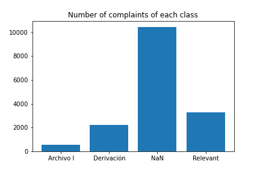

# Relevance Model: Development Process
This section is intended to document all the work which we did on building the Relevance Model, so that the work may be easily extended in the future

## Brief description of the task
In order to help SMA deal with incoming complaints more quickly, the aim here was to build a classifier which sorts the complaints into three categories: complaints which are relevant to SMA (`Relevant`), complaints which should be redirected to a different organisation (`Derivacion`) and complaints which should be archived (`Archivo I`). It is worth noting that complaints can be archived for many different reasons, such as the complaint having no legal basis, or simply being withdrawn by the complainant.

## A quick glance at the dataset
The information available to perform this classification was the information from the complaints themselves (complaint text, date filed, etc.), some geographical information about the location of the complaint and the history of inspections and sanction procedures carried out by SMA in recent years. Some information about the facilities mentioned in the complaint (such as the economic sector) was also available in some cases. 
Over 70% of the data had no end type assigned to it. Among the complaints which had an end type, there was a heavy class imbalance, with the majority of the complaints being `Relevant`, approximately a third of them resulting in `Derivacion` and a very small number of them in `Archivo I`.

## Baseline model
We began by applying a Random Forest algorithm on various combinations of features from the dataset. By training the model on the `ComplaintType`, `FacilityRegion` and `FacilityEconomicSubSector`, we were able to reach an overall accuracy of 70%, but the model was missing 34% of the complaints that should have been classed as `Relevant`. This performance is insufficient of course, as SMA cannot afford to miss a third of incoming `Relevant` complaints. This initial model was treated as our baseline model to improve upon.

## Feature Engineering
First of all, we were interested in exploring signal coming from the complaint free-text field, so we started by concatenating the text from all the different complaint details into a single string per complaint ID. We then processed the text by removing accents, punctuation and stop words. We then ran the text through a lemmatizer to reduce words to a common root word. We tried two different lemmatizers for this: one from the spaCy library and one from the Stanza package by the Stanford NLP Group. In both cases, the lemmatizers were not able to correctly lemmatize all the words, so we decided to run the lemmatized text through a stemmer (we used the SnowballStemmer, as it contains an option for Spanish), in order to ensure that the words were all reduced to the same form.

We then used this cleaned text to apply some popular Natural Language Processing techniques. We used Latent Dirichlet Allocation (LDA) to perform topic modelling and learn the most common topics from the corpus (we used both words and bigrams to generate the topics). We also used Term Frequency-Inverse Document Frequency (TF-IDF) to find the most important words (and bi- and trigrams) in each class. To do this, we grouped the complaints by class (`Relevant`, `Derivacion` or `Archivo I`) and ran a TF-IDF vectorizer on the text corpus of each group. We then took the *n* words in each category which had the highest TF-IDF score. These were passed into the model as features (columns of the dataframe), which were populated with the number of times these words occurred in the complaint text. The idea behind this was that, for example, if we see a complaint where a word highly important to the Relevant class appears several times, this complaint is likely to be a Relevant complaint. Finally, we also applied Rapid Automatic Keyword Extraction (RAKE) to detect relevant phrases.

We also tried to engineer other features from the dataset, including:

- number of words in the complaint text
- whether the complaint has an unusually high word count
- whether the complaint has an unusually low word count
- number of complaint details
- number of past sanctions associated with the facility
- total amount of past fines handed out to the facility
- whether or not the complainant is able to identify a specific facility
- quarter of the year when the complaint was made
- month of the year when the complaint was made
- day of the week when the complaint was made
- whether or not the complaint was made by a citizen
- the "natural region" where the complaint subject took place (see [Natural Regions of Chile](https://en.wikipedia.org/wiki/Natural_regions_of_Chile) on Wikipedia)
- whether or not the district is a high-population district
- the proportion of the district's land which is covered by protected areas
- the proportion of the district's land which is covered by urban area
- the proportion of the district which is covered by a declared area of poor air quality

## Modelling
We thought that a Random Forest would be a good choice of algorithm for this problem, as it can deal with both categorical and numerical features and it is capable of handling any underlying multicollinearity present in the features of the dataset.

We randomly selected 60% of the data points to make up the training set, 20% for the validation set and 20% for the test set. As we saw above, the dataset was heavily imbalanced, with much fewer examples of `Archivo I` than either other category. To ensure that the model was not prioritising any class over the others, we randomly oversampled the `Archivo I` class and randomly undersampled the `Relevant` class in the training set, so that all three classes had the same number of observations to train on. We also tried using SMOTE as an alternative to random oversampling, but this did not improve results, so we opted for the less complex random oversampler.

We will now describe the process we followed for building up the best set of features to pass into our model. Starting with just one feature, we iteratively added more features and transformed features. For each new combination that we fed into the model, we checked the overall accuracy, the confusion matrix and the proportion of relevant complaints which were missed by the classifier. When trying to decide which features were more useful to the classifier, we checked the feature importance provided by scikit-learn's Random Forest implementation. Features with a higher importance were kept and features with a lower importance could be discarded or transformed to try and obtain better results. We repeated this process several times, with different sets of features.

The model had a tendency to overfit when a high number of features were used, so we guessed some approximate parameters to limit the depth and the number of features used in each tree. Eventually, we were able to achieve an accuracy of 77.6% with 15.7% of `Relevant` complaints missed.

The model was demonstrating good performance on the `Relevant` and `Derivacion` classes, but was struggling to predict the minority class (`Archivo I`). Therefore, we decided to implement a Gradient Boosting classifier, to try and give more weight to misclassified data points and hence improve performance on the minority class. Similarly to the Random Forest, we attempted many different combinations of features. However, this did not make a significant difference to the minority class or to the overall performance. We also tried a Support Vector Machine (again using several different sets of features), but this produced slightly worse results than the Random Forest.

We also searched for some signal in the feature set that was being passed to the Random Forest, by running Principal Component Analysis on the feature set with various numbers of components, but this did not help to improve the performance. A neural network approach was briefly considered, but due to the time constraints of the project and the relatively small size of the dataset, this was not implemented.
After all these experiments, we concluded that the best model was a Random Forest with the following set of features:

-	LDA topics
-	TF-IDF words
-	presence of RAKE keywords
-	number of words in the complaint
-	environmental topics of the complaint
-	number of previous sanctions associated with this facility
-	natural region of the complaint
-	region of the facility (certain specific regions contain additional signal on top of the natural region)
-	proportion of the district which is covered by urban zones
-	proportion of the district which is covered by protected areas

The final step was the hyperparameter tuning. The metric that we wanted to minimise is the proportion of `Relevant` complaints which are missed by the model. The hyperparameters tuned were several parameters from the Random Forest algorithm. The best set of hyperparameters was found to be the following:

-	max_depth: 9
-	max_features: 50
-	n_estimators: 100
-	max_leaf_nodes : None
-	min_samples_split: 2
-	min_samples_leaf: 1

This led to an accuracy of 80.3%, with 12.5% of `Relevant` complaints missed. The model's struggles in predicting the minority class (`Archivo I`) are still evident from the confusion matrix: 

| |`Archivo 1`|`Derivacion`|`Relevant`|
|:-:|:-:|:-:|:-:|
|**`Archivo 1`**|56|23|24|
|**`Derivacion`**|61|310|45|
|**`Relevant`**|58|29|611|

## Conclusion
We were able to construct a model with reasonably good performance at classifying incoming complaints, without missing a high number of the complaints relevant to SMA. Although the model is good at classifying relevant complaints and complaints that should be redirected to a different organization, it struggles with complaints which should be archived (`Archivo I` class). This is likely due to two reasons:

1. There are far fewer data points to learn from in the `Archivo I` class
2. There are many different reasons why a complaint can end up in `Archivo I` (e.g. the complaint has no legal basis, the complaint is withdrawn by the complainant, etc.), making it difficult to detect a pattern in this class

## Future work
More data might lead to a different set of best features and (hyper-)parameters, so the model will need to be retrained at regular intervals to ensure the best possible performance. If more data fields become available, more feature engineering could be attempted and may help improve overall performance.
