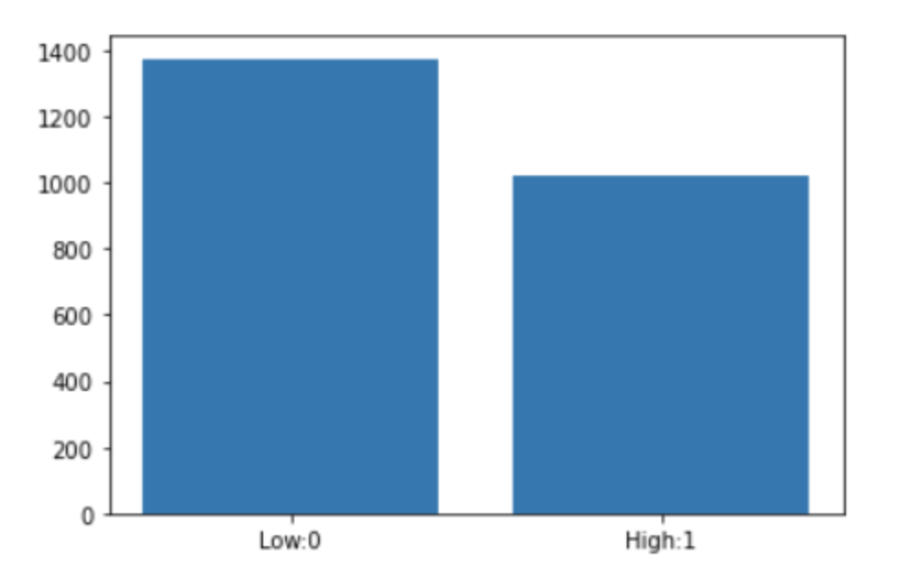
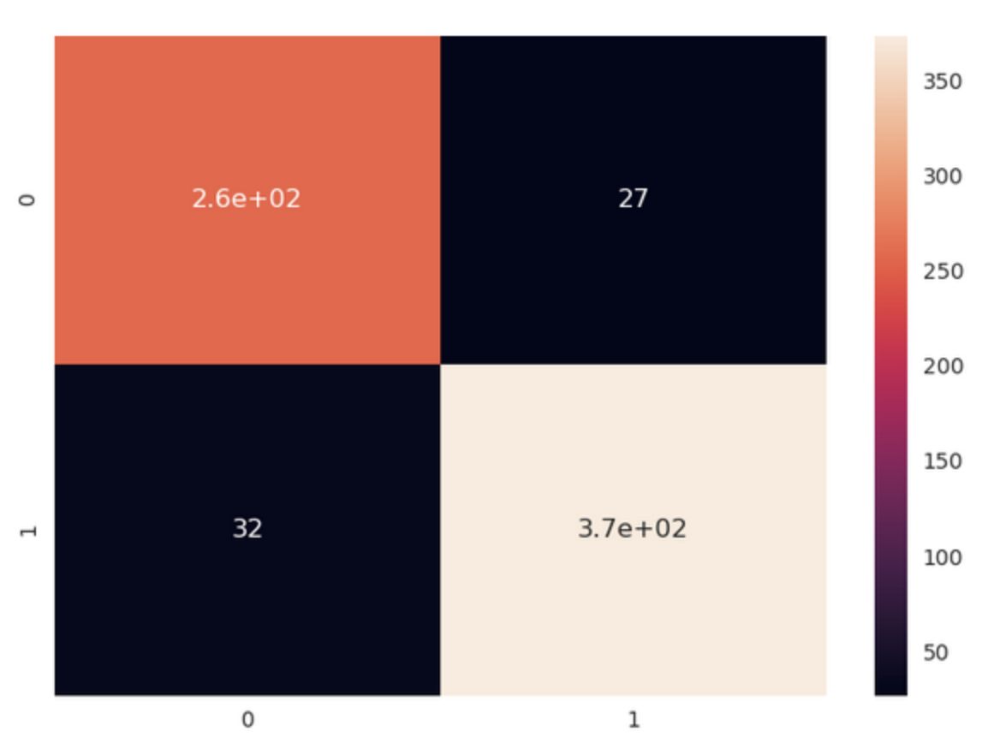

# Model Development Process
This section is intended to document all the work which has been carried out on the Sanction Gravity Model, so that the work could be easily utilized and extended in the future.

## Brief description of the task
For every new complaint coming in, the Relevancy Model would firstly predict whether this complaint is relevant to SMA, should be redirected to a different organisation (`Derivacion`) or this complaints which should be archived (`Archivo I`). For those complaints fall within SMA's remit (Labeled as 'Relevant' by the Relevancy Model), Sanction Gravity Model would conduct classification based on unstructured data fields (Complaint Text) and structured fields, generating a label of the sanction gravity level corresponding to this complaint(0: Low, 1: Medium or High). Note that the prediction will be carried out at the ComplaintId level (Aggregation of all the complaint texts related to one ComplaintId).

## A quick glance at the dataset
The dataset that was used for the Sanction Gravity Model training is composed by the historical datasets of Complaint Registry Table, Complaint Detail Table, Sanction Registry Table, Sanction Detail Table as well as Facility Registry Table, extracting only those previous complaints which are associated with one or more historical sanctions.

The concrete information used to perform this classification was the information extracted from the unstructured complaint text fields (details in the Feature Engineering Section), the date that the complaint was filed, the number of complaint texts for a single ComplaintId, some geographical information about the location of the complaint and the history of sanction infraction procedures carried out by SMA in recent years as well as the facility information associated with the complaint containing the economic sector and region.

As for the the Target variable, a representative level of the highest sanction infraction level associated with this complaint was chosen as the target variable of this complaint. This is designed to address the influence of the potentially most impactful sanction level, in contrast to choosing the sanction infraction level which occurs most frequently for that complaint. 

**Distribution of the target variable:**

The sanction infraction level can be either *Leves*, *Graves* or *Gravisimas*. However, very few complaints have an infrction of the *Gravisimas* level, so we combined this class with the *Graves* class for our target variable. Therefore, we end up with a binary target variable, which can be either `High` (*Graves* or *Gravisimas*) or `Low` (*Leves*). The distribution of the target variable can be seen in the following plot, with the class `Low` (represented by a 0 in our modelling phase) at 1018 instances and the class `High` (represented by a 1 in our modelling phase) at 1375 data points.

## Feature Engineering
### Unstructured Data Field
We use various Natural Language Processing techniques to extract features from the unstructured text field (`ComplaintDetails`) containing the description of the facts by the complainant.

#### Build up cleaned Corpus
To extract predictors from the complaint free-text field, a corpus must first be constructed. After by concatenating the complaint details by complaint Id, we apply the following common data cleaning techniques: removal of punctuation and accents, stop word removal, lemmatisation and stemming. Two lemmatisers were tried: one from the SpaCy library and one from the Stanza package by the Stanford NLP Group. Neither SpaCy or Stanza could correctly lemmatise all the words in the corpus, possibly due to variability of the vocabulary, slang words or unrecognised forms of words from the Chilean dialect which appeared in the complaint field. We therefore applied a stemmer on top of the SpaCy lemmatiser, using the built-in Spanish stemmer of the SnowballStemmer.

#### Feature extraction using NLP

We then used this cleaned text to apply some popular Natural Language Processing techniques. Latent Dirichlet Allocation (LDA) was used to perform topic modelling on the training set, in order to learn the most common topics from the corpus. For each complaint, we were then able to find the probability that the complaint text mentions each topic (this was done separately for the training and test sets, but note that the topics were learned only from the training set).

Next, Term Frequency-Inverse Document Frequency (TF-IDF) was used to extract the most important unigrams, bigrams and trigrams in each class. To achieve this, the complaints were grouped by target class (`Low` or `High`), after which a TF-IDF vectorizer was run on the corpus. We then took the *n* words in each category which had the highest TF-IDF score (*n* will be optimized in the model optimazation section) as predictors with the value for each observation being the number of times that word occurred in the complaint text. The idea behind this is that, for example, if we see a complaint where a word highly important to the `High` class appears several times, this complaint is likely to lead to a severe sanction.

The features extracted from the unstructured text field using topic modelling and the TF-IDF keyword extraction proved to be very important to the classification. Including only these features, a Random Forest model with default parameters was able to reach an accuracy of 85.1%, increasing to 86.3% after parameter tunning.

### Structured Data Fields
Other features from the structured part of the dataset were included into the model and evaluated, including:

- number of words in the complaint text
- number of complaint details contained in one complaint Id
- whether the complaint has an unusually high word count
- whether the complaint has an unusually low word count
- the sum of number of past sanctions of the facilitied associated with this sanction
- number of past infractions (low, medium and high) associated with the facilities mentioned in the complaint
- total amount of past fines handed out to this facility
- quarter of the year when the complaint was made
- month of the year when the complaint was made
- day of the week when the complaint was made
- the "natural region" where the complaint subject took place (see [Natural Regions of Chile](https://en.wikipedia.org/wiki/Natural_regions_of_Chile) on Wikipedia)

Including all the mentioned features could lead not only to multicolinearity problems in the independent variables (this is a problem for certain algorithms), but also a potential overfitting problem when the model is trained.

## Modelling
Similarly to the Relevance model, a Random Forest is a good choice of algorithm for the Sanction Gravity problem, as it can deal with both categorical and numerical features and it is capable of handling any underlying multicollinearity present in the features of the dataset.

30% of the data points were randomly selected to make up the test set, with the other 70% being used for the training set, among which 10-Fold Cross-validation was carried out to reduce potential overfitting. As mentioned earlier, there is a slight data imbalance issue in our target variable, with fewer observations in `Low` class than the `High` class. Therefore, after spliting up the training and test sets, we decided to apply a data balance technique to tackle this. Here, both undersampling and oversampling methods could offer good performance. Oversampling lead to a slightly higher accuracy and F1 score. SMOTE could also be an alternative option, but for simplicity, the oversampling method was used for the final version of model training.

The process followed to develop the sanction gravity model quite similar to that of the relevance model. Starting with the original structured data field 'Complaint Type', features were added iteratively: the text features extracted from the NLP pipeline, the seasonality, facility-related features, etc.
For each new combination that we fed into the model, the overall accuracy, F1-score, the confusion matrix and the discrepancy of performance between the validation set (average of 10 Fold) and the test set – to watch out for overfitting – were observed and recorded. The best model with the best performance, least overfitting issue and simplest predictors was chosen and used for future model evaluation and opimization.

When it comes to decide which features were more significant to the classifier, the feature importances provided by scikit-learn's Random Forest implementation was checked and recorded in Mlflow. Significant features with a higher importance were kept while features with a lower importance could be discarded or transformed to try and obtain better results. This process was repeated several times until the optimal set of feature was settled:

Unstructured fields:
-	LDA topics
-	TF-IDF words

Structured fields:
- Complaint Type
-	number of words in the complaint
- number of complaint details contained in one complaint Id
-	environmental topics of the complaint
-	number of different level of previous infraction numbers associated with this facility
-	region of the facility
-	natural region of the complaint
-	region of facility where if it's populated area or not
- Seasonality factor:  the month when the complaint was filed

Finally, hyperparameter tuning was carried out to improve model performance and reduce overfitting. The parameters tuned were the following parameters from the Random Forest algorithm: maximum number of features per tree, maximum depth of each tree, number of trees, maximum number of leaf nodes and minimum number of samples required at each leaf node. Firstly, Scikit-Learn's RandomizedSearchCV method was used to randomly sample from the grid predefined, performing K-Fold cross-validation with each combination of values. Random search helped to narrow down the range for each hyperparameter, giving us the range where to concentrate our search. Instead of sampling randomly from a distribution, GridSearchCV was used to evaluate all the combinations of settings we defined and explicitly specified to within that range. 

The best set of hyperparameters was found to be the following:

-	max_depth: 30
-	max_features: 'sqrt'
-	n_estimators: 550
-	max_leaf_nodes : 4
-	min_samples_split: 3
-	min_samples_leaf: 1
- bootstrap: False

This led to an accuracy of 91.4%, an F1-score of 91.5%, a precision of 91.5% and a recall of 91.4% in the test set. The confusion matrix shows tat the model is learning well for both classes: 

## Conclusion
A classification model with over 90% accuracy was built and used for the prediction of potential sanction gravity level. Other than using our strategy of choosing the highest level among the sanction infractions, we could also try to choosethe the most frequent infraction level as the model's dependent variable, as we discussed earlier. This will generate a similar performance, but would potentially fail to address the severity of serious infractions. Overall, the model performs well on both classes.

## Future work
-   More data might lead to a different set of best features and (hyper-)parameters, so the model will need to be retrained at regular intervals to ensure the best possible performance. 
-   If more data fields become available, more feature engineering could be attempted and may help improve overall performance.
-   Other machine learning algorithms could be experimented with, but we would need to stay cautious about the potential overfitting problems and multicollinearity in the predictors.

