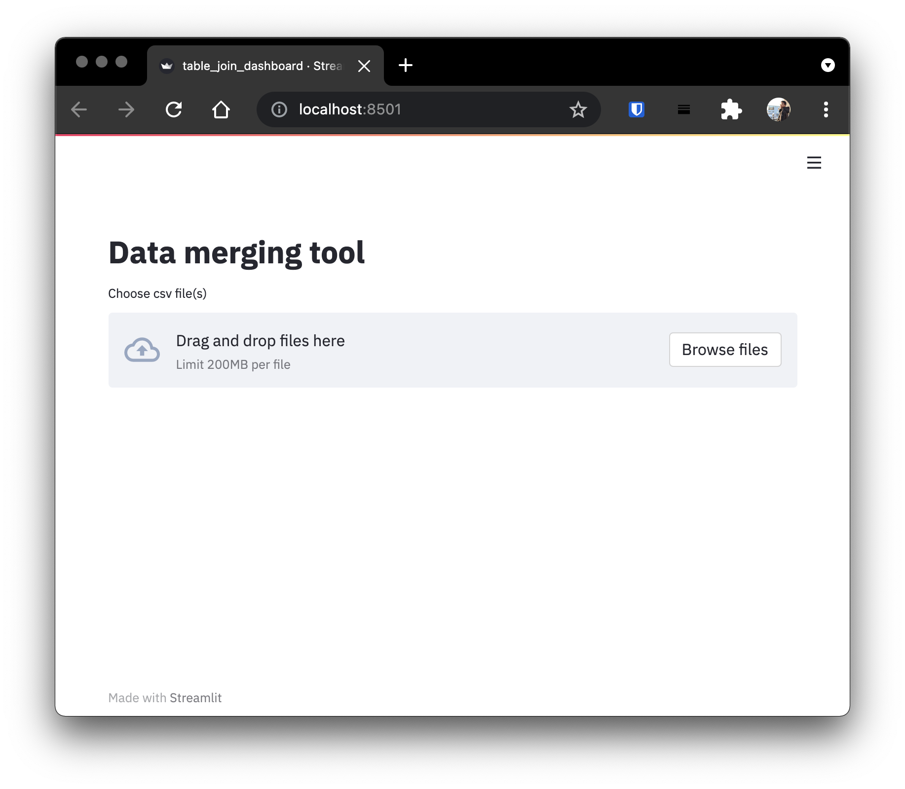

# Preparing the Data
This section covers various data preparation techniques before feature engineering is carried out
<hr>

# Introduction
The data preparation for this project happens in two folds: the first pass merges data from various CSV files into common files used for feature engineering and model training, and the second pass cleans this data by applying various data preprocessing functions on the data.

# Merging the Data Sources
## The data sources
There are four main data sources in this project: `Citizen Complaints`, `Environmental Inspections` `Sanction Procedures` and `Facility Information`.

|Source|Type|Files|
|---|---|---|
| Siden (Citizen Complaints) | Complaints |'Resumen_Denuncia',<br>'Detalle_DenunciaHecho',<br>'Detalle_DenunciaMateriaAmbienta',<br>'Detalle_DenunciaColumnasExtraI',<br>'Detalle_DenunciaPoblacionAfecta',<br>'Detallle_DenunciaImpactoSalud',<br>'Detalle_DenunciaEfectoMedioAmbi',<br>'Detalle_DenunciaGeorreferencia'|
| Sisfa (Environmental Inspections) | Inspections|'ReporteProcesoFiscalizacion', <br>'Detalle_ProcesoFiscalizacionUni'|
|Sipros (Sanction Procedure) | Sanctions | 'Resumen_ProcesoSancion'<br>'Detalle_ProcesoSancionHechoInst'|
|Facility Attributes|Facilities|'Resumen_UnidadFiscalizable'|

!!! note "File Storage"
    The files in the above sections are stored as CSV files or combined into a single Excel file with one sheet for each of the files above. 

The files in the *Complaints* type are merged to form the `ComplaintRegistry`. The complaint registry has various information about the complaint including the complaint ID (unique identifier), complaint text (free text of complaint data) and environmental topic (noise, dust, etc). 

Similar to the complaint registry, a `SanctionsRegistry` is created by merging the files in the *Sanctions* section into a single sanction registry, and the same applies for the inspections and facilities. There are also connective tables in the data to link the various data registries together.

### Putting it together
We built two tools for the data merging step: a CLI tool that takes two files at once and merges them, and a GUI dashboard that accomplishes the same functionality. We also provide a few functions that are able to automatically merge all the files into the various registries allowing for an easier way to get all the data. 

The `$PROJECT_ROOT/src/data` folder contains the `data_preprocess.py` file that contains the core functionality of the data merging tool, while the `table_join_dashboard.py` contains the data merging dashboard. The data preprocessing script allows passing command line arguments to simplify this process.

To merge two files, run
```shell
# change directory to data scripts directory
$ cd src/data
# run command to merge data files
$ python data_preprocess.py \
--input "Resumen_ProcesoSancion.csv Detalle_ProcesoSancionHechoInst.csv" \
--output "sanctions_registry.csv" \
--key "SanctionId" \
--normalize "SanctionType SanctionStatus InfractionType PenaltyType InfractionCategory InfractionDetail"
```
#### Explanation
In the above step, we run the `data_preprocess.py` script, passing in various arguments.

1. The `--input` argument specifies which files we want to merge.
2. The `--output` argument specifies where we should store the output.
3. The `--key` argument specifies what column the merge should be performed on. Internally the data merging tool uses [`pandas.merge(...)` (See pandas docs)](https://pandas.pydata.org/docs/reference/api/pandas.DataFrame.merge.html)
4. The `--normalize` flag determines which columns should be normalized to ascii. The normalization step strips all the accents and special characters, and replaces them with ASCII characters (that is `niño` -> `nino`)
   
### Data join dashboard
The exact same functionality can be achieved by using the the data merging tool dashboard. The dashboard is built using `streamlit`, a modern Python framework for rapid UI development.

To start the dashboard, run
```shell
$ python -m streamlit run table_join_dashboard.py
```
The above command will start a local server on port `8501` (the default streamlit port).



The dashboard works the same way as the script. However, the dashboard is able to process Excel files, wheras the script only works with CSV files.

### In-memory Data Merging
We can also merge the data in memory using the `merge_etl_data` method in the `data_preprocess.py` script. This function is essential when we need to make predictions from the data without necessarily writing the data to disk. It also allows some autonomy, in terms of how the data is merged and managed.

### `merge_etl_data(data_folder_path, merge_keys = MERGE_KEYS)`
:::src.data.data_preprocess.merge_etl_data


## Normalizing the data
In the data pre-processing step, we apply some basic normalizations to the data to make it easier to work with. One such normalization is normalizing the text to ASCII characters. Other normalization techniques and functions are covered in the [Feature Engineering](feature-engineering.md) section of this documentation.
```python
def character_replacement(text: str):
    text = str(text)
    return unidecode(f"{text}", "utf-8")

def normalize(df: pd.DataFrame, columns: list = []):
    for column in columns:
        df[column] = df[column].astype(str).apply(character_replacement)
    return df.replace('nan', np.nan)
```
The `normalize` function applies a character replacement on any unicode character encountered in the specified column(s).

# Conclusion
In this section we covered how the data from various sources are joined into registry files that are then used for feature engineering and model training. The next section covers in detail the feature engineering that goes into the data before each model is built.
